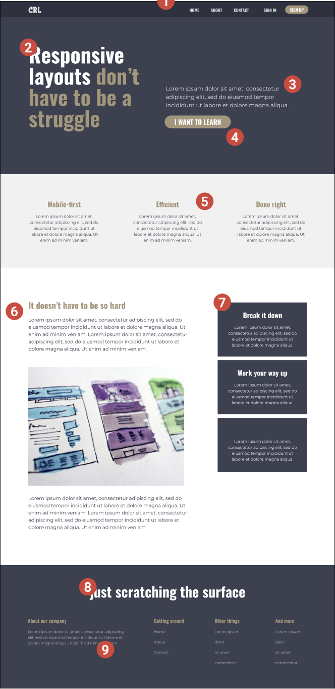
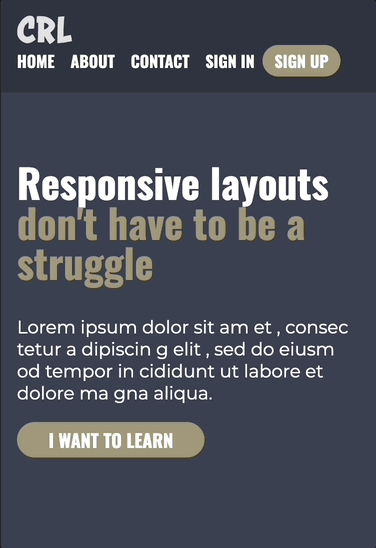

# CRL - Final Challenge

## Table of contents
  - [Overview](#overview)
    - [The challenge](#the-challenge)
    - [Screenshot](#screenshot)
    - [Links](#links)
  - [My process](#my-process)
    - [Built with](#built-with)
    - [What I learned](#what-i-learned)
    - [Useful resources](#useful-resources)

## Overview

### The challenge

Finish this layout

### Screenshot

1. 375px
  
2. 700px
   
3. 1000px
  
4. My full screen
  

### Links

- [Solution URL](https://github.com/Beginneraboutlife116/CRL---final-challenge)
- [Live Site URL](https://beginneraboutlife116.github.io/CRL---final-challenge)

## My process

### Built with

- Semantic HTML5 markup
- CSS custom properties
- CSS Grid
- CSS Flex-box
- Mobile-first workflow

### What I learned

I learn how to do the responsive layout properly.
1. At beginning, the web is responsive.
2. Don't set `height`, if you need it, you could use `min-height`. The perfect way is using `padding`
3. Using relative units more, not fixed.
4. Let browser calculate, decide.
5. The media query is based on content, not device.
6. Less code would be better for management.

### Useful resources

- [Conquering Responsive Layout](https://courses.kevinpowell.co/view/courses/conquering-responsive-layouts) - This is where this final came from. It's great to teach me how to deal with the responsive layout
- [Responsive CSS the Easy Way w/ Kevin Powell!](https://www.youtube.com/watch?v=ckCEBix9l7s&t=6s) - This live was held on 2022/6/9, and it was great, it mentioned all of the concept in CRL and others combined with more CSS concept, like logical properties, compare function.
- [Why Is CSS So Weird?](https://www.youtube.com/watch?v=aHUtMbJw8iA) - This was heard in above video. It really explains why CSS is so weird.
- [Utopia](https://utopia.fyi/) - It helps me for choosing the fluid typography and fluid space to `margin` or `padding`.